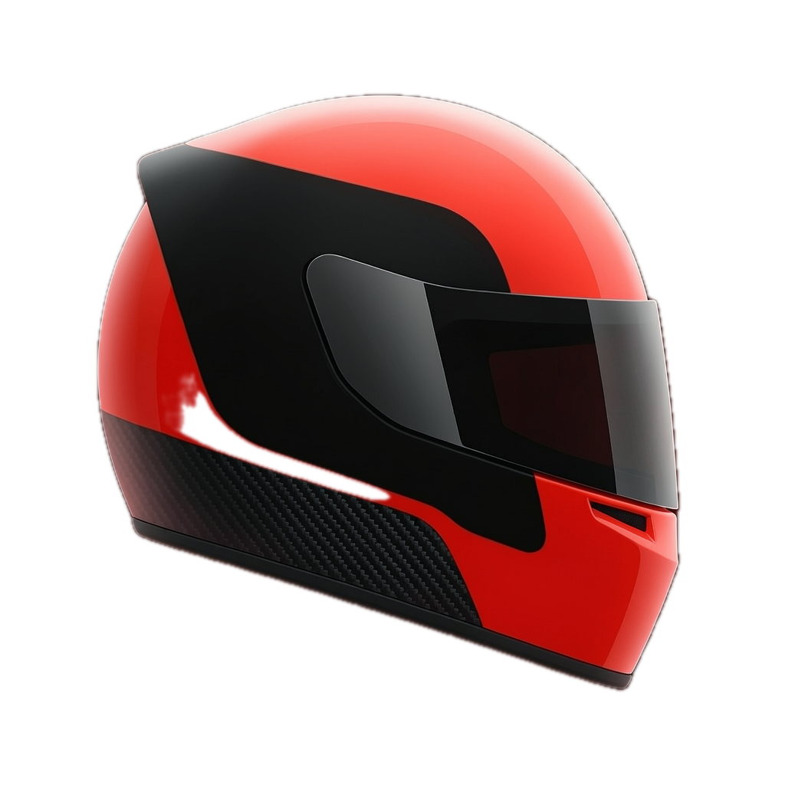

<div align="center">



# Grid

**A focus app that feels like a race weekend.**

Pick a circuit. Sign for a team. Stamp your paddock pass, watch the five lights go out — and your distracting apps stay shielded until the chequered flag.

<br/>


</div>

---

## Overview

Grid reframes focus time as a race stint. You choose a circuit (which sets the
session length) and a fictional team (whose livery themes your pass), commit by
stamping a **paddock pass**, then work while your chosen apps are blocked via the
Screen Time API. Progress is shown as laps around the real track outline, with a
Live Activity in the Dynamic Island. Leave early and your pass is stamped
**DNF** — allowed, but on the record in your Activity log.

<div align="center">

| Circuit select | Paddock pass | Locked in |
| :---: | :---: | :---: |
|  |  |  |

</div>

## How it works

1. **Onboarding.** A short, personalised quiz builds a "race plan" — how many
   hours Grid can help you win back — then a cinematic team signing puts your
   real signature on your first pass.
2. **Pick your circuit.** Twelve real-geometry circuits (plus a custom test
   track), each mapped to a focus duration from a 25-minute street sprint to a
   two-hour endurance run. A photoreal 3D flyover of the actual track plays
   behind the paddock.
3. **Stamp your pass.** A personalised paddock pass — name, circuit, team,
   session number, barcode — is issued for every session. Press and hold to
   imprint it: that stamp *is* the commitment. Fully customisable in **Pass
   Studio**.
4. **Lights out.** Five red lights, a random hold… and away you go. The shield
   activates the instant the lights go out.
5. **Stay locked in.** Your apps are blocked for the whole session. Progress is
   measured in laps; a Live Activity tracks it on the lock screen and Dynamic
   Island, with **Race Control** flags if you drift away.
6. **Chequered flag.** Finish and the pass is filed **FINISHED**; bail and it's
   a **DNF**. Every session feeds your stats and unlocks trophies.

## Features

- **12 real circuits** built from actual GPS geometry, with photoreal MapKit
  flyovers.
- **Team liveries** that theme your pass, timing name, and car number.
- **Pass Studio** — a direct-manipulation editor for every element of the pass
  (colours, wording, fonts, finish), including a holographic finish.
- **Advanced stats** — a last-session focus score, a GitHub-style contribution
  heatmap of your days on Grid, breakaway analysis, and a **trophy cabinet**.
- **The 3D Pro pass** — a gyro-reactive, holographic membership card that flips
  to reveal trophy stamps earned across your sessions.
- **Race Control** — yellow/red flags on the Live Activity when you leave
  mid-session, derived purely from time so they're crash-safe.

### Free vs Pro

| | Free | Pro |
| --- | :---: | :---: |
| Circuits | 5 | All 12 + custom |
| Team liveries | 6 | + 5 premium |
| Focus loop, Activity log, stats | ✓ | ✓ |
| Pass Studio + holographic pass | — | ✓ |
| Race Control flags + Live Activity | — | ✓ |
| 3D Pro membership card + trophies | — | ✓ |

Pro is a StoreKit 2 auto-renewable subscription (yearly with a 7-day trial, or
monthly).

## Tech

- **SwiftUI, iOS 17+**, dark theme only, MVVM, no third-party dependencies.
- **FamilyControls + ManagedSettings + DeviceActivity** for app blocking, with
  a `DeviceActivityMonitor` extension as a backstop that lifts the shield even
  if the app is killed mid-session.
- **ActivityKit** Live Activity (lock screen + Dynamic Island) with
  self-updating timers — no push updates needed.
- **MapKit** satellite flyovers driving along real circuit polylines.
- **SwiftData** for the Activity log; **StoreKit 2** subscriptions for Pro.
- Session state machine survives termination via an App Group snapshot:
  `idle → passIssued → lightsSequence → racing → finished | dnf`.

### Targets

| Target | Purpose |
| --- | --- |
| `Grid` | The app |
| `GridMonitor` | DeviceActivityMonitor extension (shield backstop) |
| `GridWidgets` | WidgetKit extension hosting the race Live Activity |

## Building

Open `Grid.xcodeproj` in Xcode 26+ and run the `Grid` scheme, or:

```sh
xcodebuild -project Grid.xcodeproj -scheme Grid \
  -destination 'generic/platform=iOS Simulator' build
```

> **Simulation mode** is on by default: the full session flow runs without
> applying a real Screen Time shield, so everything works while the
> FamilyControls distribution entitlement is pending. Toggle it in Settings
> once the entitlement is granted.

> **In-app purchases** are wired against a local `Grid/Grid.storekit`
> configuration (referenced by the `Grid` scheme's Run options), so the full
> subscribe / restore flow is testable on-device with no App Store Connect
> setup. A DEBUG **Pro access** toggle in Settings → Developer flips
> entitlement state for exercising paywalls.

## Roadmap

- [ ] Real paddock backdrop stills per circuit
- [ ] Proper open-wheel `.usdz` car model to replace the procedural one
- [ ] Sound design: doppler whooshes, light-gantry beeps, stamp thunk
- [ ] Mandatory pit-stop breaks (pomodoro mode)
- [ ] On-Demand Resources for the paid circuit assets

## Credits

Circuit outlines are derived from the
[f1-circuits](https://github.com/bacinger/f1-circuits) GeoJSON dataset
(MIT © Tomislav Bacinger), simplified and normalised at build time.

## A note on trademarks

Grid is a fan-flavoured *theme*, not an F1 product. It uses no F1 / Formula 1
logos, team or driver names, or official circuit branding — circuit names are
invented-but-evocative and fully data-driven.
