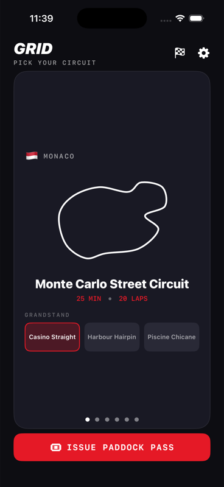
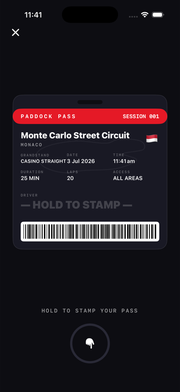
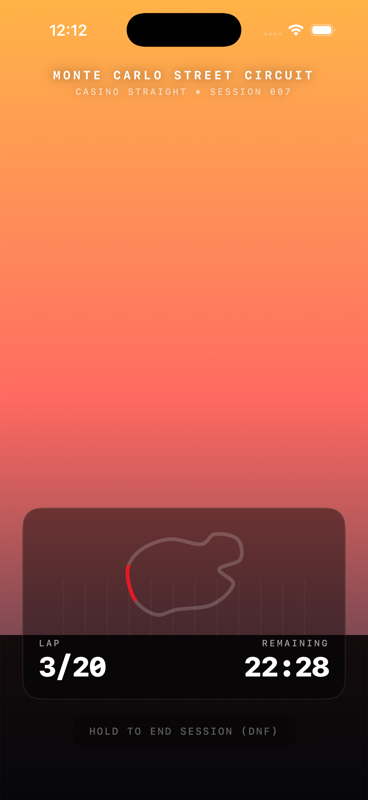

# Grid 🏁

**A focus app that feels like a race weekend.**

Pick a circuit, stamp your paddock pass, watch the five lights go out — and your
distracting apps are blocked until the chequered flag. Quit early and your pass
gets stamped **DNF** for everyone (you) to see in your Race Log.

| Circuit select | Paddock pass | Locked in |
| :---: | :---: | :---: |
|  |  |  |

## How it works

1. **Pick your circuit.** Each of the six circuits maps to a focus duration —
   a 25-minute sprint around Monte Carlo up to a 120-minute endurance run
   through the Ardennes, plus a custom-duration test track. Your grandstand
   seat decides which backdrop and car flybys you get during the session.
2. **Stamp your pass.** A personalised paddock pass — name, circuit, seat,
   session number, barcode — is issued for every session. Press and hold to
   imprint it: that stamp *is* the commitment.
3. **Lights out.** Five red lights, one per second, a random hold… and away
   you go. The shield activates the moment the lights go out.
4. **Stay locked in.** Your chosen apps are blocked via the Screen Time API
   for the whole session. Progress is measured in laps on the track outline,
   with a Live Activity in the Dynamic Island. Random flybys keep the
   grandstand alive.
5. **Chequered flag.** Finish and your pass is stamped **FINISHED** and filed
   in the Race Log. Bail early and it's a **DNF** — allowed, but remembered.

## Tech

- **SwiftUI, iOS 17+**, dark theme only, MVVM, no third-party dependencies
- **FamilyControls + ManagedSettings + DeviceActivity** for app blocking,
  with a DeviceActivityMonitor extension as a backstop that lifts the shield
  even if the app is killed mid-session
- **ActivityKit** Live Activity (lock screen + Dynamic Island) with
  self-updating timers — no push updates needed
- **SwiftData** for the Race Log, **StoreKit 2** one-time unlock
- Session state machine survives app termination via an App Group snapshot:
  `idle → passIssued → lightsSequence → racing → finished | dnf`

### Targets

| Target | Purpose |
| --- | --- |
| `Grid` | The app |
| `GridMonitor` | DeviceActivityMonitor extension (shield backstop) |
| `GridWidgets` | WidgetKit extension hosting the race Live Activity |

## Building

Open `Grid.xcodeproj` in Xcode 26+ and run the `Grid` scheme, or:

```sh
xcodebuild -project Grid.xcodeproj -scheme Grid \
  -destination 'generic/platform=iOS Simulator' build
```

> **Simulation mode** is on by default: the full session flow runs without
> applying a real Screen Time shield, so everything works in the Simulator
> and while the FamilyControls distribution entitlement is pending. Toggle it
> in Settings once the entitlement is granted.

Backdrop art and flyby clips are resolved through a thin asset layer with
placeholder fallbacks — real 9:16 backdrops and short muted clips drop in
under the names declared on each seat, no view changes required.

## Roadmap

- [ ] Real backdrop + flyby asset library (per circuit × seat)
- [ ] Sound design: doppler whooshes, light gantry beeps, stamp thunk
- [ ] Mandatory pit-stop breaks (pomodoro mode)
- [ ] On-Demand Resources for the paid circuit assets

## A note on trademarks

Grid is a fan-flavoured *theme*, not an F1 product. It uses no F1/Formula 1
logos, team or driver names, or official circuit branding — circuit names are
invented-but-evocative and fully data-driven.
